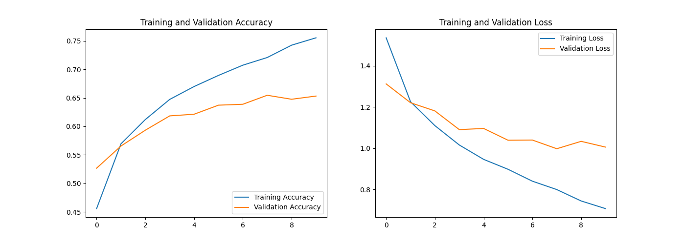

# 🧠 Deep Learning Lab - MCA S2

Practical implementations of Deep Neural Networks 

## 📁 Repository Structure
* **CNN_MNIST.ipynb**: Handwritten digit recognition.
* **CNN_CIFAR10.ipynb**: Object classification (10 classes).
* **CNN_fashionmnist.ipynb**: Clothing item classification.

## 📊 Sample Output

## 🛠️ Tools Used
`Python` `TensorFlow` `Keras` `Matplotlib`
